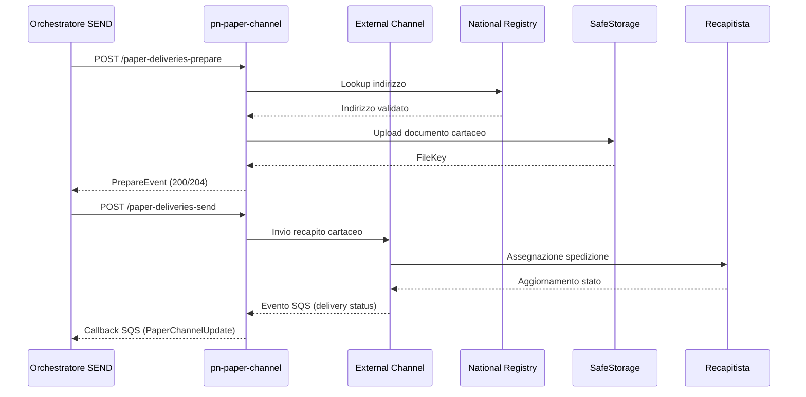
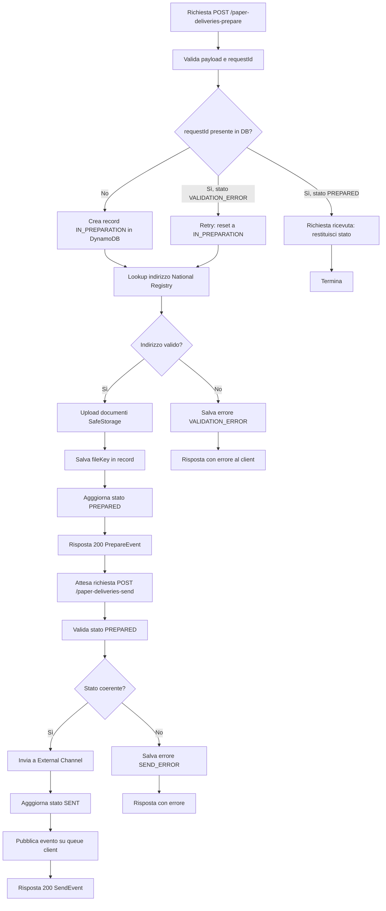

# pn-paper-channel

## Indice
- [Descrizione](#descrizione)
- [Tecnologie Utilizzate](#tecnologie-utilizzate)
- [Architettura](#architettura)
- [Interfacce del Servizio](#interfacce-del-servizio)
- [Configurazioni](#configurazioni)
- [Allarmi e Monitoraggio](#allarmi-e-monitoraggio)
- [Esecuzione](#esecuzione)

---

## Descrizione

Il servizio `pn-paper-channel` gestisce il canale analogico del dominio SEND, esponendo e consumando interfacce applicative necessarie ai flussi di notifica cartacea. 
Il servizio interagisce con componenti interni della piattaforma e con sistemi esterni correlati al ciclo di vita delle comunicazioni analogiche. 
Il dettaglio puntuale delle integrazioni sincrone e asincrone deve essere allineato alle specifiche presenti in `docs/openapi/` e alla configurazione infrastrutturale del servizio.

---

## Tecnologie Utilizzate

### Stack Tecnologico

* Java 21
* Spring Boot 3
* Spring Cloud AWS SQS
* OpenAPI 3.0.1 con generazione client/server tramite `openapi-generator-maven-plugin`
* Testcontainers e LocalStack per test con servizi AWS locali

### Infrastruttura

* AWS Lambda
* AWS API Gateway
* AWS SQS
* AWS DynamoDB
* AWS CloudWatch Logs, Dashboard e Alarm
* SafeStorage

---

## Architettura

Il servizio riceve richieste dai componenti SEND che orchestrano la notifica, applica la logica del canale cartaceo e interagisce con sistemi downstream per le operazioni di recapito e tracciamento. 
I flussi sincroni e asincroni devono essere verificati e mantenuti coerenti con le interfacce documentate.



Flusso di ciclo di vita di una richiesta di spedizione cartacea: dalla preparazione (validazione indirizzo e upload documenti) all'invio al recapitista, 
con percorsi di successo, retry su errore di validazione e gestione degli stati coerenti per l'operazione di invio.



---

## Interfacce del Servizio

| Tipo  | Dir | Risorsa              | Protocollo  | Metodo  | Route                                                                      | Descrizione                                                                     |
|-------|-----|----------------------|-------------|---------|----------------------------------------------------------------------------|---------------------------------------------------------------------------------|
| API   | IN  | pn-orchestratore     | REST        | POST    | `/paper-channel-private/v1/b2b/paper-deliveries-prepare/{requestId}`       | Richiesta di preparazione e validazione indirizzo cartaceo                      |
| API   | IN  | pn-orchestratore     | REST        | GET     | `/paper-channel-private/v1/b2b/paper-deliveries-prepare/{requestId}`       | Pull dello stato di preparazione                                                |
| API   | IN  | pn-orchestratore     | REST        | POST    | `/paper-channel-private/v1/b2b/paper-deliveries-send/{requestId}`          | Invio richiesta di spedizione cartacea                                          |
| API   | IN  | pn-orchestratore     | REST        | GET     | `/paper-channel-private/v1/b2b/paper-deliveries-send/{requestId}`          | Pull dello stato di invio                                                       |
| API   | IN  | pn-orchestratore     | REST        | POST    | `/paper-channel-private/v1/paper-deliveries-prepare/informal`              | Invio massivo di comunicazioni non legali (AMN/PEC)                             |
| API   | IN  | pn-orchestratore     | REST        | POST    | `/paper-channel-private/v2/tenders/{tenderId}/cost/calculate`              | Calcolo costo spedizione per tenderId specifico                                 |
| API   | IN  | pn-orchestratore     | REST        | GET     | `/paper-channel-private/v1/b2b/pc-retry/{requestId}`                       | Verifica disponibilità retry su delivery fallito                                |
| API   | IN  | pn-orchestratore     | REST        | GET     | `/paper-channel-private/v1/{requestId}/check-address`                      | Verifica validità indirizzo con data di scadenza                                |
| API   | IN  | pn-orchestratore     | REST        | PUT     | `/paper-channel-private/v1/rework/{requestId}/init`                        | Invalidazione timeline e ripresa elaborazione con rework                        |
| API   | IN  | Backoffice PA        | REST        | GET     | `/paper-channel-bo/v1/tenders`                                             | Elenco gare d'appalto con paginazione                                           |
| API   | IN  | Backoffice PA        | REST        | GET     | `/paper-channel-bo/v1/tenders/{tenderCode}`                                | Dettagli gara specifica                                                         |
| API   | IN  | Backoffice PA        | REST        | POST    | `/paper-channel-bo/v1/tender`                                              | Creazione o modifica gara                                                       |
| API   | IN  | Backoffice PA        | REST        | PUT     | `/paper-channel-bo/v1/tender/{tenderCode}`                                 | Aggiornamento stato gara                                                        |
| API   | IN  | Backoffice PA        | REST        | DELETE  | `/paper-channel-bo/v1/tender/{tenderCode}`                                 | Eliminazione gara                                                               |
| API   | IN  | Backoffice PA        | REST        | GET     | `/paper-channel-bo/v1/deliveries-drivers/{tenderCode}`                     | Elenco recapitisti per gara con paginazione                                     |
| API   | IN  | Backoffice PA        | REST        | GET     | `/paper-channel-bo/v1/deliveries-drivers/{tenderCode}/detail/{driverId}`   | Dettagli recapitista specifico                                                  |
| API   | IN  | Backoffice PA        | REST        | GET     | `/paper-channel-bo/v1/deliveries-drivers/{tenderCode}/fsu`                 | Dettagli FSU (Fornitore di Servizi Universali)                                  |
| API   | IN  | Backoffice PA        | REST        | POST    | `/paper-channel-bo/v1/delivery-driver/{tenderCode}`                        | Creazione o modifica recapitista                                                |
| API   | IN  | Backoffice PA        | REST        | DELETE  | `/paper-channel-bo/v1/{tenderCode}/delivery-driver/{deliveryDriverId}`     | Eliminazione recapitista                                                        |
| API   | IN  | Backoffice PA        | REST        | POST    | `/paper-channel-bo/v1/{tenderCode}/delivery-driver/{driverId}/cost`        | Creazione o modifica fascia tariffaria                                          |
| API   | IN  | Backoffice PA        | REST        | GET     | `/paper-channel-bo/v1/{tenderCode}/delivery-driver/{driverId}/get-cost`    | Elenco tariffe per recapitista/gara con paginazione                             |
| API   | IN  | Backoffice PA        | REST        | DELETE  | `/paper-channel-bo/v1/{tenderCode}/delivery-driver/{driverId}/cost/{uuid}` | Eliminazione tariffe                                                            |
| API   | IN  | Backoffice PA        | REST        | GET     | `/paper-channel-bo/v1/delivery-tender/file-download`                       | Download dati gare/recapitisti in formato file                                  |
| API   | IN  | pn-orchestratore     | REST        | GET     | `/status`                                                                  | Health check del servizio                                                       |
| EVENT | OUT | pn-orchestratore     | SQS         | PRODUCE | Queue configurata da client (X-Pagopa-Extch-CxId)                          | Aggiornamenti stato spedizione (PrepareEvent, SendEvent, PaperChannelUpdate)    |
| API   | OUT | pn-national-registry | REST        | GET     | `/api/v1/addresses/*`                                                      | Lookup indirizzo destinatario                                                   |
| API   | OUT | pn-external-channel  | REST        | POST    | `/api/v1/paper-deliveries`                                                 | Affidamento richiesta cartacea al recapitista                                   |
| API   | OUT | pn-safe-storage      | REST        | POST    | `/api/v1/file-keys`                                                        | Upload e crittografia documenti cartacei                                        |
| EVENT | IN  | pn-external-channel  | EventBridge | PUBLISH | Event pattern: paper delivery status update                                | Aggiornamenti stato da recapitista                                              |

OpenAPI:

* [pn-paper-channel-v1.yaml](docs/openapi/pn-paper-channel-v1.yaml) — API backoffice gare
* [api-internal-v1.yaml](docs/openapi/api-internal-v1.yaml) — API private orchestratore
* [external-channel/pn-external-channel.yaml](docs/openapi/external-channel/pn-external-channel.yaml) — Integrazioni canale esterno
* [national-registry/pn-national-registry-api-v1.yaml](docs/openapi/national-registry/pn-national-registry-api-v1.yaml) — Registro indirizzi
* [pn-safe-storage/pn-safestorage-v1-api.yaml](docs/openapi/pn-safe-storage/pn-safestorage-v1-api.yaml) — Storage documenti

---

## Configurazioni

| Nome                                                    | Sorgente       | Valori                     | Descrizione                                                                               |
|---------------------------------------------------------|----------------|----------------------------|-------------------------------------------------------------------------------------------|
| `PN_PAPERCHANNEL_CLIENTSAFESTORAGEBASEPATH`             | ENV            | URL                        | Base URL SafeStorage (`SandboxSafeStorageBaseUrl`).                                       |
| `PN_PAPERCHANNEL_CLIENTNATIONALREGISTRIESBASEPATH`      | ENV            | URL                        | Base URL National Registry (via ALB interno).                                             |
| `PN_PAPERCHANNEL_CLIENTEXTERNALCHANNELBASEPATH`         | ENV            | URL o mock                 | Base URL External Channel (o endpoint mock se `UseExternalChannelMock`).                  |
| `PN_PAPERCHANNEL_SAFESTORAGECXID`                       | ENV            | Stringa                    | CxId usato verso SafeStorage (`SafeStorageCxId`).                                         |
| `PN_PAPERCHANNEL_XPAGOPAEXTCHCXID`                      | ENV            | Stringa                    | CxId usato nei flussi external channel (`XPagopaExtchCxId`).                              |
| `PN_PAPERCHANNEL_NATIONALREGISTRYCXID`                  | ENV            | Stringa                    | CxId usato verso National Registry (`NationalRegistryCxId`).                              |
| `PN_PAPERCHANNEL_CLIENTDATAVAULTBASEPATH`               | ENV            | URL                        | Base URL DataVault (`DataVaultBaseUrl`).                                                  |
| `PN_PAPERCHANNEL_CLIENTADDRESSMANAGERBASEPATH`          | ENV            | URL                        | Base URL Address Manager (`AddressManagerBaseUrl`).                                       |
| `PN_PAPERCHANNEL_ADDRESSMANAGERCXID`                    | ENV            | Stringa                    | CxId usato verso Address Manager (`AddressManagerCxId`).                                  |
| `PN_PAPERCHANNEL_CLIENTF24BASEPATH`                     | ENV            | URL                        | Base URL F24 (via ALB interno).                                                           |
| `PN_PAPERCHANNEL_F24CXID`                               | ENV            | Stringa                    | CxId usato verso F24 (`F24PaperChannelUser`).                                             |
| `PN_PAPERCHANNEL_CLIENTRADDALTBASEPATH`                 | ENV            | URL                        | Base URL RADD ALT (via ALB interno).                                                      |
| `PN_PAPERCHANNEL_CLIENTPAPERTRACKERBASEPATH`            | ENV            | URL                        | Base URL Paper Tracker (via ALB interno).                                                 |
| `PN_PAPERCHANNEL_EVENTBUS_NAME`                         | ENV            | ARN EventBridge            | Event bus core usato per publish eventi.                                                  |
| `PN_PAPERCHANNEL_QUEUEINTERNAL`                         | ENV            | Nome coda SQS              | Coda interna (`ScheduledRequestsQueueName`).                                              |
| `PN_PAPERCHANNEL_QUEUEEXTERNALCHANNEL`                  | ENV            | Nome coda SQS              | Coda input da external channel dry-run (`ExternalChannelToPaperChannelDryRunQueueName`).  |
| `PN_PAPERCHANNEL_QUEUENATIONALREGISTRIES`               | ENV            | Nome coda SQS              | Coda input da national registries (`NationalRegistries2PaperChannelQueueName`).           |
| `PN_PAPERCHANNEL_QUEUEF24`                              | ENV            | Nome coda SQS              | Coda input F24 (`F24ToPaperChannelQueueName`).                                            |
| `PN_PAPERCHANNEL_QUEUENORMALIZEADDRESS`                 | ENV            | Nome coda SQS              | Coda phase-1 normalizzazione indirizzo (`PaperNormalizeAddressQueueName`).                |
| `PN_PAPERCHANNEL_QUEUEPAPERCHANNELTODELAYER`            | ENV            | Nome coda SQS              | Coda eventi da paper-channel a delayer (`PaperChannelToDelayerQueueName`).                |
| `PN_PAPERCHANNEL_QUEUEDELAYERTOPAPERCHANNEL`            | ENV            | Nome coda SQS              | Coda eventi di ritorno da delayer (`DelayerToPaperChannelQueueName`).                     |
| `PN_PAPERCHANNEL_QUEUEURLOCRINPUTS`                     | ENV            | URL coda SQS               | URL coda OCR input (`PaperChannelOcrInputsQueueURL`).                                     |
| `PN_PAPERCHANNEL_QUEUEREGIONOCRINPUTS`                  | ENV            | Regione AWS                | Regione coda OCR input (`PaperChannelOcrInputsQueueRegion`).                              |
| `PN_PAPERCHANNEL_ATTEMPTSAFESTORAGE`                    | ENV            | Numero                     | Tentativi fetch da SafeStorage (`AttemptSafeStorage`).                                    |
| `PN_PAPERCHANNEL_ATTEMPTQUEUESAFESTORAGE`               | ENV            | Numero                     | Retry coda SafeStorage (`AttemptQueueSafeStorage`).                                       |
| `PN_PAPERCHANNEL_ATTEMPTQUEUEEXTERNALCHANNEL`           | ENV            | Numero                     | Retry coda external channel (`AttemptQueueExternalChannel`).                              |
| `PN_PAPERCHANNEL_ATTEMPTQUEUENATIONALREGISTRIES`        | ENV            | Numero                     | Retry coda national registries (`AttemptQueueNationalRegistries`).                        |
| `PN_PAPERCHANNEL_ATTEMPTQUEUEADDRESSMANAGER`            | ENV            | Numero                     | Retry coda address manager (`AttemptQueueAddressManager`).                                |
| `PN_PAPERCHANNEL_ATTEMPTQUEUEF24`                       | ENV            | Numero                     | Retry coda F24 (`AttemptQueueF24`).                                                       |
| `PN_PAPERCHANNEL_ATTEMPTQUEUEZIPHANDLE`                 | ENV            | Numero                     | Retry elaborazioni ZIP (`AttemptQueueZipHandle`).                                         |
| `PN_PAPERCHANNEL_TTLPREPARE`                            | ENV            | Durata/numero              | TTL fase prepare (`TtlPrepare`).                                                          |
| `PN_PAPERCHANNEL_TTLEXECUTIONNAR`                       | ENV            | Durata/numero              | TTL execution N_AR (`TtlExecutionRNAR`).                                                  |
| `PN_PAPERCHANNEL_TTLEXECUTIONN890`                      | ENV            | Durata/numero              | TTL execution N_890 (`TtlExecutionRN890`).                                                |
| `PN_PAPERCHANNEL_TTLEXECUTIONNRS`                       | ENV            | Durata/numero              | TTL execution N_RS (`TtlExecutionRNRS`).                                                  |
| `PN_PAPERCHANNEL_TTLEXECUTIONIAR`                       | ENV            | Durata/numero              | TTL execution I_AR (`TtlExecutionRIAR`).                                                  |
| `PN_PAPERCHANNEL_TTLEXECUTIONIRS`                       | ENV            | Durata/numero              | TTL execution I_RS (`TtlExecutionRIRS`).                                                  |
| `PN_PAPERCHANNEL_TTLEXECUTIONDAYSDEMAT`                 | ENV            | Giorni                     | TTL retention dati demat (`TtlExecutionDaysDemat`).                                       |
| `PN_PAPERCHANNEL_TTLEXECUTIONDAYSMETA`                  | ENV            | Giorni                     | TTL retention metadati (`TtlExecutionDaysMeta`).                                          |
| `PN_PAPERCHANNEL_REFINEMENTDURATION`                    | ENV            | Durata (`d/h/m/s`)         | Durata refinement (`RefinementDuration`).                                                 |
| `PN_PAPERCHANNEL_COMPIUTAGIACENZAARDURATION`            | ENV            | Durata (`d/h/m/s`)         | Durata compiuta giacenza AR (`CompiutaGiacenzaArDuration`).                               |
| `PN_PAPERCHANNEL_ENABLETRUNCATEDDATEFORREFINEMENTCHECK` | ENV            | `true/false`               | Abilita check refinement su data troncata (`EnableTruncatedDateForRefinementCheck`).      |
| `PN_PAPERCHANNEL_RETRYSTATUS`                           | ENV            | Codice stato               | Stato usato nei flussi di retry (`RetryStatus`).                                          |
| `PN_PAPERCHANNEL_DATECHARGECALCULATIONMODES`            | ENV            | Lista `timestamp;mode`     | Configurazione modalità calcolo costo (`DateChargeCalculationModes`).                     |
| `PN_PAPERCHANNEL_REQUIREDDEMATS`                        | ENV            | CSV codici demat           | Eventi demat obbligatori (`RequiredDemats`).                                              |
| `PN_PAPERCHANNEL_COMPLEXREFINEMENTCODES`                | ENV            | CSV codici                 | Codici con flusso refinement legacy (`ComplexRefinementCodes`).                           |
| `PN_PAPERCHANNEL_ENABLESIMPLIFIEDTENDERFLOW`            | ENV            | `true/false`               | Feature flag tender semplificato (`EnableSimplifiedTenderFlow`).                          |
| `PN_PAPERCHANNEL_SENDPROGRESSMETA`                      | ENV            | Enum                       | Feature flag metadati progress (`SendProgressMeta`).                                      |
| `PN_PAPERCHANNEL_COSTROUNDINGMODE`                      | ENV            | `HALF_UP` / `UP`           | Regola arrotondamento costi (`CostRoundingMode`).                                         |
| `PN_PAPERCHANNEL_SENDCON020`                            | ENV            | `true/false`               | Abilita invio messaggi CON020 (`SendCon020`).                                             |
| `PN_PAPERCHANNEL_ENABLERETRYCON996`                     | ENV            | `true/false`               | Abilita retry messaggi CON996 (`EnableRetryCon996`).                                      |
| `PN_PAPERCHANNEL_PREPARETWOPHASES`                      | ENV            | `true/false`               | Abilita flusso PREPARE in due fasi (`PrepareTwoPhases`).                                  |
| `PN_PAPERCHANNEL_ENABLEPREPAREPHASEONE`                 | ENV            | `true/false`               | Abilita consumer fase 1 PREPARE (`EnablePreparePhaseOne`).                                |
| `PN_PAPERCHANNEL_PNADDR001CONTINUEFLOW`                 | ENV            | `true/false`               | Comportamento su errore PNADDR001 (`Pnaddr001ContinueFlow`).                              |
| `PN_PAPERCHANNEL_PNADDR002CONTINUEFLOW`                 | ENV            | `true/false`               | Comportamento su errore PNADDR002 (`Pnaddr002ContinueFlow`).                              |
| `PN_PAPERCHANNEL_ENABLEDOCFILTERRULEENGINE`             | ENV            | `true/false`               | Abilita motore filtro documenti (`EnableDocFilterRuleEngine`).                            |
| `PN_PAPERCHANNEL_REQUESTPAIDOVERRIDE`                   | ENV            | Stringa (PA ID/P.IVA)      | Override tecnico `RequestPAId` (`RequestPaIdOverride`).                                   |
| `PN_PAPERCHANNEL_PAPERWEIGHT`                           | ENV            | Numero                     | Peso unitario foglio (`PaperWeight`).                                                     |
| `PN_PAPERCHANNEL_LETTERWEIGHT`                          | ENV            | Numero                     | Peso unitario lettera (`LetterWeight`).                                                   |
| `PN_PAPERCHANNEL_RADDCOVERAGESEARCHMODE`                | ENV            | Valore da SSM              | Modalità ricerca copertura RADD (`/config/radd-coverage/search-mode`).                    |
| `AWS_DYNAMODBREQUESTDELIVERYTABLE`                      | ENV            | Nome tabella               | Tabella richieste delivery (`RequestDeliveryDynamoTableName`).                            |
| `AWS_DYNAMODBADDRESSTABLE`                              | ENV            | Nome tabella               | Tabella indirizzi (`AddressDynamoTableName`).                                             |
| `AWS_DYNAMODBTENDERTABLE`                               | ENV            | Nome tabella               | Tabella tender legacy (`TenderDynamoTableName`).                                          |
| `AWS_DYNAMODBDELIVERYDRIVERTABLE`                       | ENV            | Nome tabella               | Tabella delivery driver legacy (`DeliveryDriverDynamoTableName`).                         |
| `AWS_DYNAMODBCOSTTABLE`                                 | ENV            | Nome tabella               | Tabella costi legacy (`CostDynamoTableName`).                                             |
| `AWS_DYNAMODBZONETABLE`                                 | ENV            | Nome tabella               | Tabella zone (`ZoneDynamoTableName`).                                                     |
| `AWS_DYNAMODBCAPTABLE`                                  | ENV            | Nome tabella               | Tabella CAP (`CapDynamoTableName`).                                                       |
| `AWS_DYNAMODBDELIVERYFILETABLE`                         | ENV            | Nome tabella               | Tabella file delivery (`DeliveryFileDynamoTableName`).                                    |
| `AWS_DYNAMODBPAPERREQUESTERRORTABLE`                    | ENV            | Nome tabella               | Tabella errori richiesta (`PaperRequestErrorTableName`).                                  |
| `AWS_DYNAMODBPAPEREVENTSTABLE`                          | ENV            | Nome tabella               | Tabella eventi paper (`PaperEventsTableName`).                                            |
| `AWS_DYNAMODBCLIENTTABLE`                               | ENV            | Nome tabella               | Tabella client (`ClientDynamoTableName`).                                                 |
| `AWS_DYNAMODBPAPEREVENTERRORTABLE`                      | ENV            | Nome tabella               | Tabella errori eventi (`PaperEventErrorDynamoTableName`).                                 |
| `AWS_DYNAMODBPAPERCHANNELTENDERTABLE`                   | ENV            | Nome tabella               | Tabella tender nuovo dominio (`PaperChannelTenderDynamoTableName`).                       |
| `AWS_DYNAMODBPAPERCHANNELGEOKEYTABLE`                   | ENV            | Nome tabella               | Tabella geokey (`PaperChannelGeokeyDynamoTableName`).                                     |
| `AWS_DYNAMODBPAPERCHANNELDELIVERYDRIVERTABLE`           | ENV            | Nome tabella               | Tabella delivery driver nuovo dominio (`PaperChannelDeliveryDriverDynamoTableName`).      |
| `AWS_DYNAMODBPAPERCHANNELCOSTTABLE`                     | ENV            | Nome tabella               | Tabella costi nuovo dominio (`PaperChannelCostDynamoTableName`).                          |
| `SandboxSafeStorageBaseUrl`                             | CloudFormation | URL                        | Base URL SafeStorage passata al container.                                                |
| `ExternalChannelBaseUrl`                                | CloudFormation | URL                        | Base URL External Channel o modalità mock.                                                |
| `AttemptSafeStorage`                                    | CloudFormation | Numero                     | Tentativi per recupero file da SafeStorage.                                               |
| `AttemptQueueExternalChannel`                           | CloudFormation | Numero                     | Tentativi per consumer External Channel.                                                  |
| `AttemptQueueNationalRegistries`                        | CloudFormation | Numero                     | Tentativi per consumer National Registries.                                               |
| `AttemptQueueSafeStorage`                               | CloudFormation | Numero                     | Tentativi per retry SafeStorage.                                                          |
| `AttemptQueueAddressManager`                            | CloudFormation | Numero                     | Tentativi per retry Address Manager.                                                      |
| `AttemptQueueF24`                                       | CloudFormation | Numero                     | Tentativi per retry F24.                                                                  |
| `AttemptQueueZipHandle`                                 | CloudFormation | Numero                     | Tentativi per gestione ZIP.                                                               |
| `MaxPcRetry`                                            | CloudFormation | Numero                     | Massimo retry per `PcRetry`.                                                              |
| `SafeStorageCxId`                                       | CloudFormation | Stringa                    | CxId SafeStorage.                                                                         |
| `F24PaperChannelUser`                                   | CloudFormation | Stringa                    | CxId F24.                                                                                 |
| `AddressManagerCxId`                                    | CloudFormation | Stringa                    | CxId Address Manager.                                                                     |
| `AddressManagerBaseUrl`                                 | CloudFormation | URL                        | Base URL Address Manager.                                                                 |
| `DataVaultBaseUrl`                                      | CloudFormation | URL                        | Base URL DataVault.                                                                       |
| `XPagopaExtchCxId`                                      | CloudFormation | Stringa                    | CxId per External Channel.                                                                |
| `NationalRegistryCxId`                                  | CloudFormation | Stringa                    | CxId per National Registry.                                                               |
| `TtlPrepare`                                            | CloudFormation | Stringa                    | TTL fase prepare.                                                                         |
| `TtlExecutionRNAR`                                      | CloudFormation | Stringa                    | TTL execution RN AR.                                                                      |
| `TtlExecutionRN890`                                     | CloudFormation | Stringa                    | TTL execution RN 890.                                                                     |
| `TtlExecutionRNRS`                                      | CloudFormation | Stringa                    | TTL execution RN RS.                                                                      |
| `TtlExecutionRIAR`                                      | CloudFormation | Stringa                    | TTL execution RI AR.                                                                      |
| `TtlExecutionRIRS`                                      | CloudFormation | Stringa                    | TTL execution RI RS.                                                                      |
| `TtlExecutionDaysDemat`                                 | CloudFormation | Stringa                    | TTL giorni demat.                                                                         |
| `TtlExecutionDaysMeta`                                  | CloudFormation | Stringa                    | TTL giorni metadati.                                                                      |
| `RefinementDuration`                                    | CloudFormation | Stringa                    | Durata refinement.                                                                        |
| `CompiutaGiacenzaArDuration`                            | CloudFormation | Stringa                    | Durata compiuta giacenza AR.                                                              |
| `EnableTruncatedDateForRefinementCheck`                 | CloudFormation | `true/false`               | Abilita troncamento data per refinement check.                                            |
| `PaperWeight`                                           | CloudFormation | Stringa                    | Peso foglio.                                                                              |
| `LetterWeight`                                          | CloudFormation | Stringa                    | Peso lettera.                                                                             |
| `RetryStatus`                                           | CloudFormation | Stringa                    | Stato retry.                                                                              |
| `RequestDeliveryDynamoTableName`                        | CloudFormation | Nome tabella               | Nome tabella request delivery.                                                            |
| `DeliveryFileDynamoTableName`                           | CloudFormation | Nome tabella               | Nome tabella delivery file.                                                               |
| `AddressDynamoTableName`                                | CloudFormation | Nome tabella               | Nome tabella address.                                                                     |
| `TenderDynamoTableName`                                 | CloudFormation | Nome tabella               | Nome tabella tender legacy.                                                               |
| `DeliveryDriverDynamoTableName`                         | CloudFormation | Nome tabella               | Nome tabella delivery driver legacy.                                                      |
| `CostDynamoTableName`                                   | CloudFormation | Nome tabella               | Nome tabella cost legacy.                                                                 |
| `ZoneDynamoTableName`                                   | CloudFormation | Nome tabella               | Nome tabella zone.                                                                        |
| `CapDynamoTableName`                                    | CloudFormation | Nome tabella               | Nome tabella CAP.                                                                         |
| `PaperRequestErrorTableName`                            | CloudFormation | Nome tabella               | Nome tabella errori request.                                                              |
| `ClientDynamoTableName`                                 | CloudFormation | Nome tabella               | Nome tabella client.                                                                      |
| `PaperEventsTableName`                                  | CloudFormation | Nome tabella               | Nome tabella eventi paper.                                                                |
| `PaperEventErrorDynamoTableName`                        | CloudFormation | Nome tabella               | Nome tabella errori eventi.                                                               |
| `PaperChannelTenderDynamoTableName`                     | CloudFormation | Nome tabella               | Nome tabella tender paper-channel.                                                        |
| `PaperChannelGeokeyDynamoTableName`                     | CloudFormation | Nome tabella               | Nome tabella geokey paper-channel.                                                        |
| `PaperChannelDeliveryDriverDynamoTableName`             | CloudFormation | Nome tabella               | Nome tabella delivery driver paper-channel.                                               |
| `PaperChannelCostDynamoTableName`                       | CloudFormation | Nome tabella               | Nome tabella cost paper-channel.                                                          |
| `NationalRegistries2PaperChannelQueueName`              | CloudFormation | Nome coda SQS              | Nome coda national registries verso paper-channel.                                        |
| `F24ToPaperChannelQueueName`                            | CloudFormation | Nome coda SQS              | Nome coda F24 verso paper-channel.                                                        |
| `ExternalChannelToPaperChannelDryRunQueueName`          | CloudFormation | Nome coda SQS              | Nome coda dry-run da External Channel.                                                    |
| `ScheduledRequestsQueueName`                            | CloudFormation | Nome coda SQS              | Coda richieste schedulate/interna.                                                        |
| `PaperNormalizeAddressQueueName`                        | CloudFormation | Nome coda SQS              | Coda normalizzazione indirizzo.                                                           |
| `DateChargeCalculationModes`                            | CloudFormation | Stringa                    | Modalità calcolo charge.                                                                  |
| `RequiredDemats`                                        | CloudFormation | CSV codici                 | Demat obbligatori.                                                                        |
| `ComplexRefinementCodes`                                | CloudFormation | CSV codici                 | Codici refinement complessi.                                                              |
| `EnableSimplifiedTenderFlow`                            | CloudFormation | `true/false`               | Abilita tender flow semplificato.                                                         |
| `SendProgressMeta`                                      | CloudFormation | Enum                       | Feature flag SendProgressMeta.                                                            |
| `CostRoundingMode`                                      | CloudFormation | `HALF_UP` / `UP`           | Modalità arrotondamento costi.                                                            |
| `RequestPaIdOverride`                                   | CloudFormation | Stringa                    | Override della partita IVA/RequestPAId.                                                   |
| `Pnaddr001ContinueFlow`                                 | CloudFormation | `true/false`               | Continuità flusso su errore PNADDR001.                                                    |
| `Pnaddr002ContinueFlow`                                 | CloudFormation | `true/false`               | Continuità flusso su errore PNADDR002.                                                    |
| `EnableDocFilterRuleEngine`                             | CloudFormation | `true/false`               | Abilita filtro documenti.                                                                 |
| `SendCon020`                                            | CloudFormation | `true/false`               | Abilita invio CON020.                                                                     |
| `EnableRetryCon996`                                     | CloudFormation | `true/false`               | Abilita retry CON996.                                                                     |
| `PaperChannelToDelayerQueueARN`                         | CloudFormation | ARN coda SQS               | ARN coda da paper-channel a delayer.                                                      |
| `DelayerToPaperChannelQueueARN`                         | CloudFormation | ARN coda SQS               | ARN coda da delayer a paper-channel.                                                      |
| `PaperChannelPrepareToDelayerQueuePipeDesiredState`     | CloudFormation | `RUNNING` / `STOPPED`      | Stato desiderato della pipe.                                                              |
| `PrepareTwoPhases`                                      | CloudFormation | `true/false`               | Abilita prepare in due fasi.                                                              |
| `EnablePreparePhaseOne`                                 | CloudFormation | `true/false`               | Abilita consumer prepare fase 1.                                                          |
| `PaperChannelToDelayerQueueName`                        | CloudFormation | Nome coda SQS              | Nome coda paper-channel to delayer.                                                       |
| `DelayerToPaperChannelQueueName`                        | CloudFormation | Nome coda SQS              | Nome coda delayer to paper-channel.                                                       |
| `PaperChannelOcrInputsQueueRegion`                      | CloudFormation | Regione AWS                | Regione coda OCR input.                                                                   |
| `PnDelayerToPaperChannelEventBusRuleStatus`             | CloudFormation | `ENABLED` / `DISABLED`     | Stato della rule EventBridge.                                                             |
| `TenderAPILambdaName`                                   | CloudFormation | Stringa                    | Nome Lambda Tender API.                                                                   |
| `TenderAPILambdaRuntime`                                | CloudFormation | Runtime Lambda             | Runtime della Lambda Tender API.                                                          |
| `PaperTrackerEnabled`                                   | CloudFormation | `true/false`               | Abilita Paper Tracker.                                                                    |
| `PaperTrackerProductList`                               | CloudFormation | Lista prodotti             | Prodotti tracciati da Paper Tracker.                                                      |

---

## Allarmi e Monitoraggio

| Tipo      | Nome                                                          | Descrizione                                                                                                             |
|-----------|---------------------------------------------------------------|-------------------------------------------------------------------------------------------------------------------------|
| ALARM     | `FatalLogsMetricAlarmArn`                                     | Allarme log fatali del microservizio ECS `PaperChannelMicroservice`.                                                    |
| ALARM     | `RestApiErrorAlarmArn`                                        | Allarme errori API Gateway esposta da `PaperChannelGatewayDeliveryDriver`.                                              |
| ALARM     | `RestApiLatencyAlarmArn`                                      | Allarme latenza API Gateway esposta da `PaperChannelGatewayDeliveryDriver`.                                             |
| ALARM     | `PaperRequestErrorAlarm.Arn`                                  | Allarme CloudWatch su metrica `PNPaperErrorRequest` (resource `PaperRequestErrorAlarm`).                                |
| DASHBOARD | `PaperChannelMicroserviceCloudWatchDashboard`                 | Dashboard CloudWatch del microservizio; aggrega metriche e allarmi di ECS, API Gateway, DynamoDB, code SQS e log group. |
| LOG       | `EcsLogGroup`                                                 | Log group ECS del microservizio `pn-paper-channel`, usato per log applicativi e tracciamento MDC.                       |

---

## Esecuzione

### Prerequisiti

* Java 21
* Node.js 20+
* Docker 27+ oppure Podman attivo per i test di integrazione
* Build locale dei progetti `pn-parent` e `pn-commons` e `pn-model` da cui `pn-paper-channel` dipende

### Build

```bash
    git clone https://github.com/pagopa/pn-paper-channel.git
    cd pn-paper-channel
    ./mvnw clean install
```

### Test

```bash
    ./mvnw verify
```

### Avvio locale

```bash
    ./mvnw spring-boot:run -Dspring-boot.run.profiles=local
```