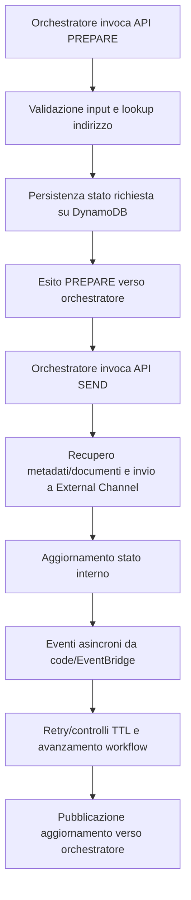
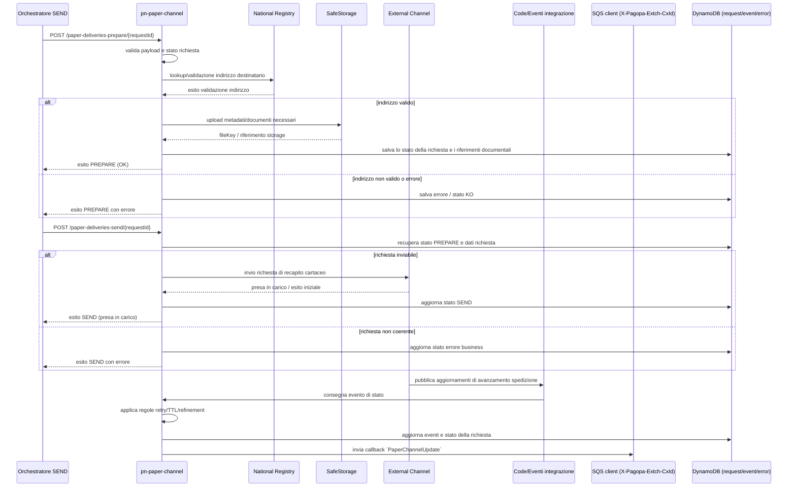

# Architettura interna pn-paper-channel

Questo documento descrive i flussi interni del microservizio `pn-paper-channel`, usando come fonti il codice applicativo, le specifiche OpenAPI e i template CloudFormation presenti nel repository.

Il servizio gestisce il canale cartaceo del dominio SEND, orchestrando flussi sincroni (API REST) e asincroni (SQS/EventBridge) per preparazione, invio e aggiornamento di stato delle spedizioni analogiche.

## Componenti

| Componente                                                            | Responsabilità                                                                                                                   | Fonte                                                                                                                |
|-----------------------------------------------------------------------|----------------------------------------------------------------------------------------------------------------------------------|----------------------------------------------------------------------------------------------------------------------|
| API private orchestratore (`paper-channel-private`)                   | Espone le API di preparazione, invio, retry e verifica indirizzo del flusso paper verso i sistemi orchestranti SEND.             | `docs/openapi/api-internal-v1.yaml`, `scripts/aws/cfn/microservice.yml`                                              |
| API backoffice (`paper-channel-bo`)                                   | Espone le API di gestione tender, recapitisti e costi (CRUD e consultazione) per il dominio backoffice paper.                    | `docs/openapi/pn-paper-channel-v1.yaml`, `scripts/aws/cfn/microservice.yml`                                          |
| Client REST `pn-national-registry`                                    | Effettua lookup/validazione indirizzi destinatario nei flussi di preparazione e controllo indirizzo.                             | `docs/openapi/national-registry/pn-national-registry-api-v1.yaml`, `docs/openapi/national-registry/remote-refs.yaml` |
| Client REST `pn-external-channel`                                     | Invia richieste di recapito cartaceo e integra gli aggiornamenti di stato del ciclo di consegna.                                 | `docs/openapi/external-channel/pn-external-channel.yaml`, `docs/openapi/external-channel/schemas-paper-v1.yaml`      |
| Client REST `pn-safe-storage`                                         | Gestisce upload/cifratura documenti e metadati necessari al ciclo di vita della comunicazione cartacea.                          | `docs/openapi/pn-safe-storage/pn-safestorage-v1-api.yaml`, `docs/openapi/pn-safe-storage/`                           |
| Event bus e code di integrazione                                      | Trasportano eventi di aggiornamento stato tra `pn-paper-channel`, orchestratore e componenti esterni.                            | `scripts/aws/cfn/microservice.yml`, `scripts/aws/cfn/storage.yml`                                                    |
| Code applicative interne (`scheduled`, `normalize`, `delayer`, `ocr`) | Abilitano workflow asincroni (prepare/send), normalizzazione indirizzi, ritardi programmati e passaggi OCR.                      | `scripts/aws/cfn/microservice.yml`, `scripts/aws/cfn/storage.yml`                                                    |
| Persistenza DynamoDB (request/event/error/tender/costi/geokey)        | Memorizza stato richieste, eventi, errori e dati di dominio per tracciabilità e idempotenza operativa.                           | `scripts/aws/cfn/storage.yml`, `scripts/aws/cfn/microservice.yml`                                                    |
| Regole runtime (retry, TTL, feature flag)                             | Governa tentativi, retention temporale e varianti di comportamento del flusso (prepare a due fasi, refinement, gestione errori). | `scripts/aws/cfn/microservice.yml`                                                                                   |

## Flusso end-to-end

## Preparazione spedizione analogica

Il servizio riceve la richiesta POST `/paper-channel-private/v1/b2b/paper-deliveries-prepare/{requestId}` dall’orchestratore SEND. La richiesta viene validata, viene effettuato il lookup di validazione indirizzo tramite integrazione con `pn-national-registry` e viene persistito lo stato della richiesta nelle tabelle DynamoDB del dominio paper-channel.

In caso di esito positivo della validazione, il servizio prepara i riferimenti documentali su SafeStorage e aggiorna i metadati della richiesta. In caso di errore di validazione o indisponibilità di una dipendenza esterna, il servizio persiste l’errore applicativo e restituisce l’esito coerente con le specifiche OpenAPI.

## Invio spedizione e aggiornamenti asincroni

Il servizio riceve la richiesta POST `/paper-channel-private/v1/b2b/paper-deliveries-send/{requestId}`, recupera lo stato della richiesta, verifica la coerenza del flusso e invia la richiesta di recapito a `pn-external-channel` tramite API REST.

Dopo la presa in carico, gli aggiornamenti di avanzamento vengono gestiti tramite canali asincroni (SQS/EventBridge) e la timeline viene aggiornata nelle tabelle eventi del dominio. 
L’invio degli aggiornamenti verso il chiamante è associato al valore dell’header `X-Pagopa-Extch-CxId`, secondo quanto previsto dalle specifiche.

## Flussi di controllo e retry

Le API GET `/paper-channel-private/v1/b2b/paper-deliveries-prepare/{requestId}` e `/paper-channel-private/v1/b2b/paper-deliveries-send/{requestId}` espongono lo stato corrente della richiesta. L’API GET `/paper-channel-private/v1/b2b/pc-retry/{requestId}` verifica la disponibilità di tentativi ulteriori in base alle regole configurate.

Il flusso di retry e retention è governato dai parametri `PN_PAPERCHANNEL_ATTEMPT*` e `PN_PAPERCHANNEL_TTL*`. L’API PUT `/paper-channel-private/v1/rework/{requestId}/init` abilita l’invalidazione della timeline e la ripresa del flusso correttivo in coerenza con la configurazione runtime.
Il flusso `/rework/{requestId}/init` (PUT) permette l'invalidazione della timeline e la ripresa dell'elaborazione.

## Stato persistito su DynamoDB

La tabella `RequestDeliveryDynamoTable` (parametro `RequestDeliveryDynamoTableName`) è la tabella principale per il ciclo di vita della richiesta.

| Campo                          | Uso                                                                   |
|--------------------------------|-----------------------------------------------------------------------|
| `requestId`                    | Identificativo univoco della richiesta; partition key della tabella.  |
| `fiscalCode`                   | Codice fiscale del destinatario.                                      |
| `hashedFiscalCode`             | Versione hash del codice fiscale per esigenze di trattamento dati.    |
| `receiverType`                 | Tipo di destinatario associato alla richiesta.                        |
| `iun`                          | Identificativo univoco della notifica SEND associata alla richiesta.  |
| `correlationId`                | Identificativo di correlazione                                        |
| `addressHash`                  | Hash dell’indirizzo associato alla richiesta.                         |
| `hashOldAddress`               | Hash del precedente indirizzo, quando presente nel flusso correttivo. |
| `statusCode`                   | Codice di stato corrente della richiesta.                             |
| `statusDetail`                 | Dettaglio aggiuntivo dello stato corrente.                            |
| `statusDescription`            | Descrizione testuale dello stato corrente.                            |
| `statusDate`                   | Riferimento temporale associato allo stato corrente.                  |
| `proposalProductType`          | Prodotto postale proposto nel flusso.                                 |
| `printType`                    | Modalità di stampa richiesta per la spedizione.                       |
| `startDate`                    | Data/ora di avvio del processo associato alla richiesta.              |
| `productType`                  | Tipologia di prodotto postale gestita dalla richiesta.                |
| `relatedRequestId`             | Eventuale requestId correlato ad altri flussi o retry.                |
| `attachments`                  | Allegati/documenti associati alla richiesta.                          |
| `removedAttachments`           | Allegati esclusi o rimossi durante l’elaborazione.                    |
| `requestPaId`                  | Identificativo della PA mittente associato alla richiesta.            |
| `eventToSend`                  | Evento da produrre o inoltrare nel flusso applicativo.                |
| `cost`                         | Costo calcolato o associato alla richiesta.                           |
| `reworkNeeded`                 | Indicatore di necessità di rework.                                    |
| `reworkNeededCount`            | Numero di occorrenze o tentativi di rework.                           |
| `refined`                      | Indicatore di perfezionamento del flusso.                             |
| `driverCode`                   | Codice del recapitista associato.                                     |
| `tenderCode`                   | Codice tender associato alla richiesta.                               |
| `notificationSentAt`           | Timestamp di invio della notifica.                                    |
| `aarWithRadd`                  | Indicatore relativo al trattamento AAR/RADD.                          |
| `feedbackStatusCode`           | Codice di feedback ricevuto dai flussi di recapito.                   |
| `feedbackDeliveryFailureCause` | Motivo di fallimento recapito restituito dai feedback.                |
| `feedbackStatusDateTime`       | Timestamp del feedback di stato ricevuto.                             |
| `feedbackOriginalStatusCode`   | Codice di stato originale restituito dal sistema esterno.             |
| `applyRasterization`           | Indicatore applicativo per il trattamento di rasterizzazione.         |
| `senderPaId`                   | Identificativo del mittente associato alla richiesta.                 |
| `notificationReworkId`         | Identificativo del flusso di rework associato.                        |
| `communicationType`            | Tipologia di comunicazione gestita.                                   |
| `clientId`                     | Identificativo client associato alla richiesta.                       |
| `senderPriority`               | Priorità del mittente associata alla richiesta.                       |

### Tabelle di supporto

| Tabella                                     | Scopo operativo                                   |
|---------------------------------------------|---------------------------------------------------|
| `AddressDynamoTableName`                    | Persistenza indirizzi associati alla richiesta.   |
| `PaperEventsTableName`                      | Persistenza eventi/timeline di stato.             |
| `PaperRequestErrorTableName`                | Persistenza errori di richiesta.                  |
| `PaperEventErrorDynamoTableName`            | Persistenza errori su eventi asincroni.           |
| `PaperChannelTenderDynamoTableName`         | Persistenza dominio tender (nuovo modello).       |
| `PaperChannelDeliveryDriverDynamoTableName` | Persistenza recapitisti per tender.               |
| `PaperChannelCostDynamoTableName`           | Persistenza costi/tariffe del dominio paper.      |

## Code e risorse infrastrutturali rilevanti

| Risorsa                                                     | Configurazione rilevante                                                                                               | Fonte                                                             |
|-------------------------------------------------------------|------------------------------------------------------------------------------------------------------------------------|-------------------------------------------------------------------|
| `ScheduledRequestsQueue`                                    | Coda SQS interna `${ProjectName}-paper_channel_requests`, `VisibilityTimeout: 60`.                                     | `scripts/aws/cfn/storage.yml`                                     |
| `PaperNormalizeAddressQueue`                                | Coda SQS `${ProjectName}-paper-normalize-address`, `VisibilityTimeout: 60`.                                            | `scripts/aws/cfn/storage.yml`                                     |
| `ExternalChannelToPaperChannelDryRunQueue`                  | Coda SQS `${ProjectName}-external_channel_to_paper_channel_dry_run`, `VisibilityTimeout: 60`.                          | `scripts/aws/cfn/storage.yml`                                     |
| `PaperChannelOcrOutputsQueue`                               | Coda SQS `${ProjectName}-paper_channel_ocr_outputs`, `VisibilityTimeout: 60`.                                          | `scripts/aws/cfn/storage.yml`                                     |
| `RequestDeliveryDynamoTable`                                | Tabella DynamoDB `${ProjectName}-PaperRequestDelivery`, PK `requestId`, GSI `fiscal-code-index` e `correlation-index`. | `scripts/aws/cfn/storage.yml`                                     |
| `AddressDynamoTable`                                        | Tabella DynamoDB `${ProjectName}-PaperAddress`, PK `requestId` + SK `addressType`, TTL su `ttl`.                       | `scripts/aws/cfn/storage.yml`                                     |
| `PaperEventsTable`                                          | Tabella eventi di stato richiesta; nome iniettato come parametro `PaperEventsTableName`.                               | `scripts/aws/cfn/storage.yml`, `scripts/aws/cfn/microservice.yml` |
| `PaperRequestErrorTable`                                    | Tabella errori richiesta; nome iniettato come parametro `PaperRequestErrorTableName`.                                  | `scripts/aws/cfn/storage.yml`, `scripts/aws/cfn/microservice.yml` |
| `PaperEventErrorDynamoTable`                                | Tabella errori eventi; nome iniettato come parametro `PaperEventErrorDynamoTableName`.                                 | `scripts/aws/cfn/storage.yml`, `scripts/aws/cfn/microservice.yml` |
| `PN_PAPERCHANNEL_EVENTBUS_NAME`                             | Nome/ARN EventBridge usato dal servizio per publish eventi (`eventbus.name`).                                          | `scripts/aws/cfn/microservice.yml`                                |
| `PaperChannelToDelayerQueue` / `DelayerToPaperChannelQueue` | Integrazione con delayer tramite `QueueName`, `QueueARN` e `QueueURL` passati al servizio.                             | `scripts/aws/cfn/microservice.yml`                                |
| `PaperChannelOcrInputsQueue`                                | Integrazione OCR in input tramite `QueueARN`, `QueueURL` e `QueueRegion` passati al servizio.                          | `scripts/aws/cfn/microservice.yml`                                |
| `PaperChannelMicroserviceCloudWatchDashboard`               | Dashboard operativa con metriche/allarmi di API, code, DynamoDB e log group del servizio.                              | `scripts/aws/cfn/microservice.yml`                                |

## Configurazioni funzionali coinvolte

| Proprietà applicativa                                         | Variabile ambiente                                      | Descrizione                                                |
|---------------------------------------------------------------|---------------------------------------------------------|------------------------------------------------------------|
| `pn.paper-channel.client-safe-storage-basepath`               | `PN_PAPERCHANNEL_CLIENTSAFESTORAGEBASEPATH`             | Base URL SafeStorage per upload/download documenti.        |
| `pn.paper-channel.client-national-registries-basepath`        | `PN_PAPERCHANNEL_CLIENTNATIONALREGISTRIESBASEPATH`      | Base URL National Registry per lookup indirizzi.           |
| `pn.paper-channel.client-external-channel-basepath`           | `PN_PAPERCHANNEL_CLIENTEXTERNALCHANNELBASEPATH`         | Base URL External Channel per invio cartaceo.              |
| `pn.paper-channel.client-datavault-basepath`                  | `PN_PAPERCHANNEL_CLIENTDATAVAULTBASEPATH`               | Base URL DataVault.                                        |
| `pn.paper-channel.client-address-manager-basepath`            | `PN_PAPERCHANNEL_CLIENTADDRESSMANAGERBASEPATH`          | Base URL Address Manager per normalizzazione indirizzi.    |
| `pn.paper-channel.client-f24-basepath`                        | `PN_PAPERCHANNEL_CLIENTF24BASEPATH`                     | Base URL F24.                                              |
| `pn.paper-channel-client-raddalt-basepath`                    | `PN_PAPERCHANNEL_CLIENTRADDALTBASEPATH`                 | Base URL RADD ALT.                                         |
| `pn.paper-channel.safe-storage-cx-id`                         | `PN_PAPERCHANNEL_SAFESTORAGECXID`                       | CxId client SafeStorage.                                   |
| `pn.paper-channel.x-pagopa-extch-cx-id`                       | `PN_PAPERCHANNEL_XPAGOPAEXTCHCXID`                      | CxId per External Channel.                                 |
| `pn.paper-channel.national-registry-cx-id`                    | `PN_PAPERCHANNEL_NATIONALREGISTRYCXID`                  | CxId per National Registry.                                |
| `pn.paper-channel.address-manager-cx-id`                      | `PN_PAPERCHANNEL_ADDRESSMANAGERCXID`                    | CxId per Address Manager.                                  |
| `pn.paper-channel.f24-cx-id`                                  | `PN_PAPERCHANNEL_F24CXID`                               | CxId per F24.                                              |
| `pn.paper-channel.eventbus.name`                              | `PN_PAPERCHANNEL_EVENTBUS_NAME`                         | ARN EventBridge per publish eventi verso orchestratore.    |
| `pn.paper-channel.queue-internal`                             | `PN_PAPERCHANNEL_QUEUEINTERNAL`                         | Nome coda SQS interna per richieste schedulate.            |
| `pn.paper-channel.queue-external-channel`                     | `PN_PAPERCHANNEL_QUEUEEXTERNALCHANNEL`                  | Nome coda SQS input da External Channel (dry-run).         |
| `pn.paper-channel.queue-national-registries`                  | `PN_PAPERCHANNEL_QUEUENATIONALREGISTRIES`               | Nome coda SQS input da National Registry.                  |
| `pn.paper-channel.queue-f24`                                  | `PN_PAPERCHANNEL_QUEUEF24`                              | Nome coda SQS input da F24.                                |
| `pn.paper-channel.queue-normalize-address`                    | `PN_PAPERCHANNEL_QUEUENORMALIZEADDRESS`                 | Nome coda normalizzazione indirizzo (fase 1 PREPARE).      |
| `pn.paper-channel.queue-paperchannel-to-delayer`              | `PN_PAPERCHANNEL_QUEUEPAPERCHANNELTODELAYER`            | Nome coda output verso delayer per ritardi programmati.    |
| `pn.paper-channel.queue-delayer-to-paperchannel`              | `PN_PAPERCHANNEL_QUEUEDELAYERTOPAPERCHANNEL`            | Nome coda input da delayer per rientro nel workflow.       |
| `pn.paper-channel.queue-url-ocr-inputs`                       | `PN_PAPERCHANNEL_QUEUEURLOCRINPUTS`                     | URL coda OCR input.                                        |
| `pn.paper-channel.queue-region-ocr-inputs`                    | `PN_PAPERCHANNEL_QUEUEREGIONOCRINPUTS`                  | Regione AWS coda OCR input.                                |
| `pn.paper-channel.attempt-safe-storage`                       | `PN_PAPERCHANNEL_ATTEMPTSAFESTORAGE`                    | Numero tentativi fetch SafeStorage.                        |
| `pn.paper-channel.attempt-queue-safe-storage`                 | `PN_PAPERCHANNEL_ATTEMPTQUEUESAFESTORAGE`               | Numero retry coda SafeStorage.                             |
| `pn.paper-channel.attempt-queue-external-channel`             | `PN_PAPERCHANNEL_ATTEMPTQUEUEEXTERNALCHANNEL`           | Numero retry coda External Channel.                        |
| `pn.paper-channel.attempt-queue-national-registries`          | `PN_PAPERCHANNEL_ATTEMPTQUEUENATIONALREGISTRIES`        | Numero retry coda National Registry.                       |
| `pn.paper-channel.attempt-queue-address-manager`              | `PN_PAPERCHANNEL_ATTEMPTQUEUEADDRESSMANAGER`            | Numero retry coda Address Manager.                         |
| `pn.paper-channel.attempt-queue-f24`                          | `PN_PAPERCHANNEL_ATTEMPTQUEUEF24`                       | Numero retry coda F24.                                     |
| `pn.paper-channel.attempt-queue-zip-handle`                   | `PN_PAPERCHANNEL_ATTEMPTQUEUEZIPHANDLE`                 | Numero retry elaborazioni ZIP.                             |
| `pn.paper-channel.ttl-prepare`                                | `PN_PAPERCHANNEL_TTLPREPARE`                            | TTL fase prepare (giorni).                                 |
| `pn.paper-channel.ttl-execution-N_AR`                         | `PN_PAPERCHANNEL_TTLEXECUTIONNAR`                       | TTL execution N_AR.                                        |
| `pn.paper-channel.ttl-execution-N_890`                        | `PN_PAPERCHANNEL_TTLEXECUTIONN890`                      | TTL execution N_890.                                       |
| `pn.paper-channel.ttl-execution-N_RS`                         | `PN_PAPERCHANNEL_TTLEXECUTIONNRS`                       | TTL execution N_RS.                                        |
| `pn.paper-channel.ttl-execution-I_AR`                         | `PN_PAPERCHANNEL_TTLEXECUTIONIAR`                       | TTL execution I_AR.                                        |
| `pn.paper-channel.ttl-execution-I_RS`                         | `PN_PAPERCHANNEL_TTLEXECUTIONIRS`                       | TTL execution I_RS.                                        |
| `pn.paper-channel.ttl-execution-days-demat`                   | `PN_PAPERCHANNEL_TTLEXECUTIONDAYSDEMAT`                 | TTL retention giorni dati demat.                           |
| `pn.paper-channel.ttl-execution-days-meta`                    | `PN_PAPERCHANNEL_TTLEXECUTIONDAYSMETA`                  | TTL retention giorni metadati.                             |
| `pn.paper-channel.refinement-duration`                        | `PN_PAPERCHANNEL_REFINEMENTDURATION`                    | Durata del perfezionamento (es. `10d`).                    |
| `pn.paper-channel.compiuta-giacenza-ar-duration`              | `PN_PAPERCHANNEL_COMPIUTAGIACENZAARDURATION`            | Durata compiuta giacenza AR (es. `30d`).                   |
| `pn.paper-channel.enable-truncated-date-for-refinement-check` | `PN_PAPERCHANNEL_ENABLETRUNCATEDDATEFORREFINEMENTCHECK` | Tronca datetime a data locale per il controllo refinement. |
| `pn.paper-channel.retry-status`                               | `PN_PAPERCHANNEL_RETRYSTATUS`                           | Codice stato usato nei flussi di retry.                    |
| `pn.paper-channel.date-charge-calculation-modes`              | `PN_PAPERCHANNEL_DATECHARGECALCULATIONMODES`            | Modalità calcolo costo in formato `timestamp;mode`.        |
| `pn.paper-channel.required-demats`                            | `PN_PAPERCHANNEL_REQUIREDDEMATS`                        | Codici demat obbligatori (es. per eventi PNAG012).         |
| `pn.paper-channel.complex-refinement-codes`                   | `PN_PAPERCHANNEL_COMPLEXREFINEMENTCODES`                | Codici 890 gestiti con flusso refinement legacy.           |
| `pn.paper-channel.paper-weight`                               | `PN_PAPERCHANNEL_PAPERWEIGHT`                           | Peso unitario foglio.                                      |
| `pn.paper-channel.letter-weight`                              | `PN_PAPERCHANNEL_LETTERWEIGHT`                          | Peso unitario lettera.                                     |
| `pn.paper-channel.RequestPaIdOverride`                        | `PN_PAPERCHANNEL_REQUESTPAIDOVERRIDE`                   | Override tecnico del `RequestPAId` (partita IVA).          |
| `pn.paper-channel.enabledocfilterruleengine`                  | `PN_PAPERCHANNEL_ENABLEDOCFILTERRULEENGINE`             | Abilita il motore di filtro documenti.                     |
| `pn.paper-channel.sendCon020`                                 | `PN_PAPERCHANNEL_SENDCON020`                            | Abilita invio messaggi CON020 a delivery push.             |
| `pn.paper-channel.radd-coverage-search-mode`                  | `PN_PAPERCHANNEL_RADDCOVERAGESEARCHMODE`                | Modalità ricerca copertura RADD.                           |
| `pn.paper-channel.enable-simplified-tender-flow`              | `PN_PAPERCHANNEL_ENABLESIMPLIFIEDTENDERFLOW`            | Feature flag flusso tender semplificato.                   |
| `pn.paper-channel.prepare-two-phases`                         | `PN_PAPERCHANNEL_PREPARETWOPHASES`                      | Feature flag prepare a due fasi.                           |
| `pn.paper-channel.enable-prepare-phase-one`                   | `PN_PAPERCHANNEL_ENABLEPREPAREPHASEONE`                 | Feature flag consumer fase 1 prepare.                      |
| `pn.paper-channel.paper-tracker-enabled`                      | `PN_PAPERCHANNEL_PAPERTRACKERENABLED`                   | Abilita Paper Tracker.                                     |
| `pn.paper-channel.paper-tracker-product-list`                 | `PN_PAPERCHANNEL_PAPERTRACKERPRODUCTLIST`               | Prodotti tracciati da Paper Tracker.                       |

## Osservabilità

Il microservizio espone metriche e log operativi attraverso le risorse CloudWatch definite nei template infrastrutturali. La configurazione include log group ECS, dashboard CloudWatch e integrazione con metriche e allarmi associati alle API, alle code SQS e alle tabelle DynamoDB del dominio.

## File sorgente principali

| Area                          | File                                                                                            |
|-------------------------------|-------------------------------------------------------------------------------------------------|
| API private orchestratore     | `docs/openapi/api-internal-v1.yaml`                                                             |
| API backoffice                | `docs/openapi/pn-paper-channel-v1.yaml`                                                         |
| Consumer richieste analogiche | `src/main/java/it/pagopa/pn/paperchannel/middleware/queue/consumer/QueueListener.java`          |
| Elaborazione preparazione     | `src/main/java/it/pagopa/pn/paperchannel/service/impl/PrepareAsyncServiceImpl.java`             |
| Elaborazione invio            | `src/main/java/it/pagopa/pn/paperchannel/service/impl/PaperChannelServiceImpl.java`             |
| Client National Registry      | `src/main/java/it/pagopa/pn/paperchannel/middleware/msclient/NationalRegistryClient.java`       |
| Client External Channel       | `src/main/java/it/pagopa/pn/paperchannel/middleware/msclient/ExternalChannelClient.java`        |
| Client SafeStorage            | `src/main/java/it/pagopa/pn/paperchannel/middleware/msclient/SafeStorageClient.java`            |
| Stato DynamoDB richieste      | `src/main/java/it/pagopa/pn/paperchannel/middleware/db/entities/PnDeliveryRequest.java`         |
| Infrastruttura                | `scripts/aws/cfn/storage.yml`, `scripts/aws/cfn/microservice.yml`                               |